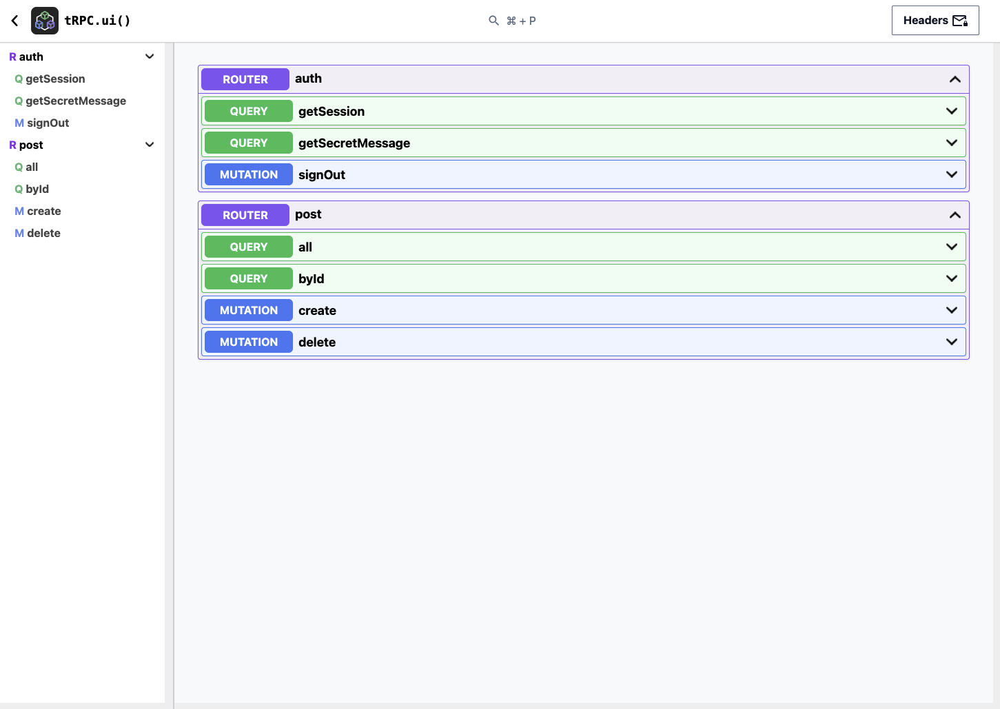

# tRPC UI (tRPC Panel Fork)

[tRPC UI](https://github.com/aidansunbury/trpc-ui) is set up on this project and can be accessed from the dev server by going to [`http://localhost:3000/api/panel`](http://localhost:3000/api/panel).

## Auth

You may need to copy an auth header from API requests from the main application and paste them into the `Headers` modal in the top right of tRPC UI.
