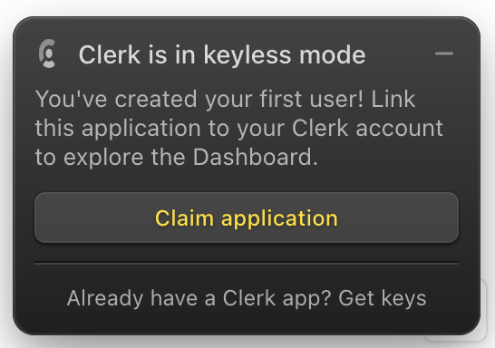

---
tags:
  - Repo setup
---

# Clerk

[Clerk](https://clerk.com/docs) is a popular authentication service that we use in this repo.

## Quickstart

Start the web app (see [Local Development](../project-structure/apps/next/local-development.mdx)) and see the Clerk components in action.

Login to the application and you should see a popup from Clerk to claim the app:



Click `Claim Application` and follow the instructions to continue setting up Clerk.

## tRPC

tRPC is pre-configured to use Clerk for authentication. The `auth()` function is called in tRPC's `createContext` function and can be accessed in the `ctx` object in any tRPC route handler.

## Components

See `apps/nextjs/src/app/_components/auth-showcase.tsx` below for an example of how to use the Clerk components. The `SignedOut` and `SignedIn` components are used to conditionally render the components based on the user's authentication state and the `UserButton` component is used to display the user's profile information.

```tsx
"use client";

import {
  SignedIn,
  SignedOut,
  SignInButton,
  SignUpButton,
  UserButton,
} from "@clerk/nextjs";

export function AuthShowcase() {
  return (
    <div className="flex flex-col items-center justify-center gap-4">
      <SignedOut>
        <SignInButton />
        <SignUpButton />
      </SignedOut>
      <SignedIn>
        <UserButton />
      </SignedIn>
    </div>
  );
}
```

The [Clerk docs](https://clerk.com/docs/components/overview) have more information on the components and how to use them.

## Configuration

Most Clerk configuration is done from the [Clerk Dashboard](https://dashboard.clerk.com/).
